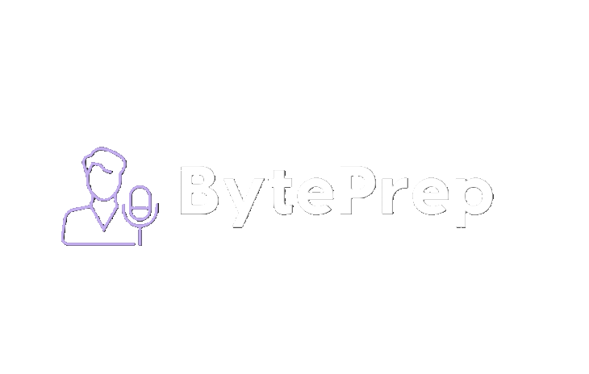

# BytePrep - AI-Voice Based Interview Preparation App

BytePrep is an AI-powered voice-based interview preparation application. It allows users to set up calls for specific types of interviews based on role, level, and tech stack, and provides AI-curated feedback. The app leverages Google Firebase for authentication and storage, Google Gemini 2.0 for interview and feedback generation, and Next.js 15 for both frontend and backend development.

## Tech Stack
- Next.js
- Firebase
- Tailwind CSS
- Vapi AI
- shadcn/ui
- Google Gemeni
- Zod

## Features

- **Authentication:** Sign Up and Sign In using password/email authentication handled by Firebase.
- **Create Interviews:** Easily generate job interviews with the help of Vapi voice assistants and Google Gemini.
- **Get AI Feedback:** Conduct interviews with an AI voice agent and receive instant feedback based on your responses.
- **Modern UI/UX:** A sleek, user-friendly interface designed for a seamless experience.
- **Interview Page:** Engage in AI-driven interviews with real-time feedback and detailed transcripts.
- **Dashboard:** Manage and track all your interviews with easy navigation.
- **Responsiveness:** Fully responsive design that works across devices.
- **Code Architecture:** Well-structured and reusable codebase for scalability and maintainability.

## Installation

### Prerequisites
- Node.js (v18+ recommended)
- npm or yarn
- Firebase account setup
- Gemini setup
- Vapi ai setup

### Steps to Run Locally

**Cloning the Repository**

```bash
git clone
cd BytePrep
```

**Installation**

Install the project dependencies using npm:

```bash
npm install
```

**Set Up Environment Variables**

Create a new file named `.env.local` in the root of your project and add the following content:

```env
NEXT_PUBLIC_VAPI_WEB_TOKEN=
NEXT_PUBLIC_VAPI_WORKFLOW_ID=

GOOGLE_GENERATIVE_AI_API_KEY=

NEXT_PUBLIC_BASE_URL=

NEXT_PUBLIC_FIREBASE_API_KEY=
NEXT_PUBLIC_FIREBASE_AUTH_DOMAIN=
NEXT_PUBLIC_FIREBASE_PROJECT_ID=
NEXT_PUBLIC_FIREBASE_STORAGE_BUCKET=
NEXT_PUBLIC_FIREBASE_MESSAGING_SENDER_ID=
NEXT_PUBLIC_FIREBASE_APP_ID=

FIREBASE_PROJECT_ID=
FIREBASE_CLIENT_EMAIL=
FIREBASE_PRIVATE_KEY=
```

Replace the placeholder values with your actual Firebase and Vapi credentials.

**Running the Project**

```bash
npm run dev
```

Open [http://localhost:3000](http://localhost:3000) in your browser to view the project.
